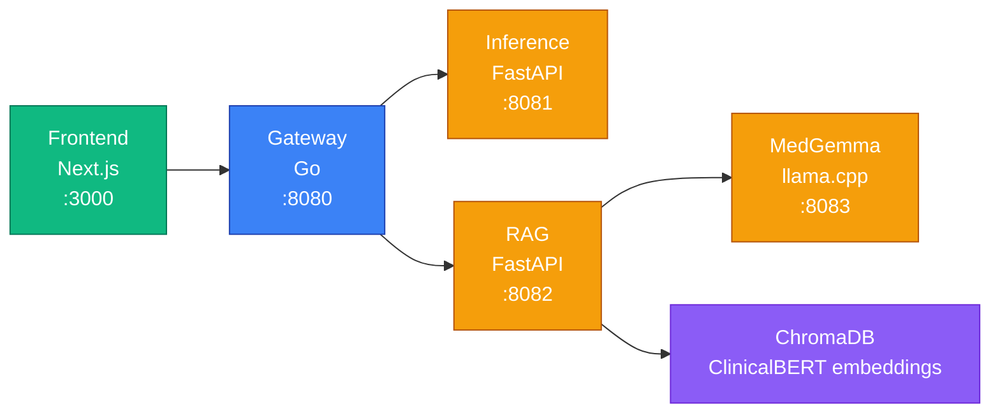
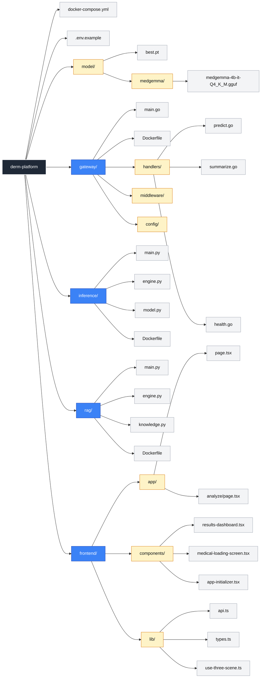
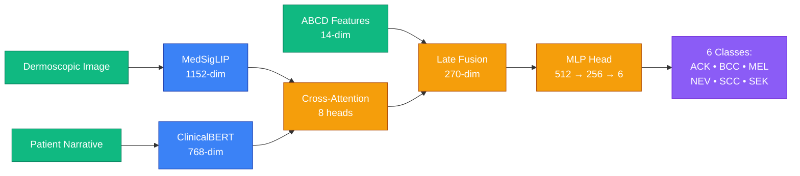

# derm-platform

Production-grade web platform for multimodal skin cancer detection, powered by MedSigLIP vision encoding, ClinicalBERT text encoding, and MedGemma RAG-based clinical summaries.

## ⚠️ Disclaimer

**This project is for educational and research purposes only.** It is not a medical device, has not been validated for clinical use, and must not be used to diagnose, treat, or make decisions about any real medical condition. The model was trained on a single dataset (PAD-UFES-20, 2,298 images) and has known limitations — including a low SCC F1 score (0.43), limited fairness validation across Fitzpatrick skin types, and no cross-validation. Always consult a licensed dermatologist for any skin health concerns.

## Architecture



## Services

| Service | Stack | Port | Description |
|---------|-------|------|-------------|
| Gateway | Go 1.22+ | 8080 | Request routing, validation, CORS, file upload handling |
| Inference | Python / FastAPI | 8081 | MedSigLIP + ClinicalBERT + ABCD fusion model |
| RAG | Python / FastAPI | 8082 | Retrieval-augmented clinical summary generation |
| MedGemma | llama.cpp (GGUF) | 8083 | Medical LLM for grounded clinical text generation |
| Frontend | Next.js + shadcn/ui | 3000 | Clinical analysis UI with explainability dashboard |

## Quick Start

### Prerequisites

- Docker Desktop with **14GB+ memory** allocated
- [HuggingFace account](https://huggingface.co/settings/tokens) with access to:
  - [google/medsiglip-448](https://huggingface.co/google/medsiglip-448) (gated)
  - [google/medgemma-4b-it](https://huggingface.co/google/medgemma-4b-it) (gated)

### Setup

```bash
# 1. Clone
git clone https://github.com/multimodal-derm/derm-platform.git
cd derm-platform

# 2. Add environment variables
echo "HF_TOKEN=hf_your_token_here" > .env

# 3. Download model weights
# Place best.pt in model/
mkdir -p model/medgemma
# Download MedGemma GGUF:
hf download lmstudio-community/medgemma-4b-it-GGUF medgemma-4b-it-Q4_K_M.gguf --local-dir model/medgemma

# 4. Start all services
docker compose up --build
```

The app will be available at [http://localhost:3000](http://localhost:3000). First startup takes 2–3 minutes while models load.

## API Endpoints

| Method | Path | Description |
|--------|------|-------------|
| `POST` | `/api/v1/predict` | Multimodal skin lesion classification |
| `POST` | `/api/v1/summarize` | RAG clinical summary via MedGemma |
| `GET` | `/api/v1/health` | Gateway + inference health check |
| `GET` | `/api/v1/model/info` | Model metadata |

## Project Structure



## Model Pipeline



**6 classes:** ACK (Actinic Keratosis), BCC (Basal Cell Carcinoma), MEL (Melanoma), NEV (Nevus), SCC (Squamous Cell Carcinoma), SEK (Seborrheic Keratosis)

**Training results:** Macro F1 = 0.7558, ROC-AUC = 0.9494, Accuracy = 74.1%

## RAG Pipeline

After classification, the system generates a clinical summary:

1. **Retrieve** — ClinicalBERT embeddings query ChromaDB (28 dermatology knowledge documents)
2. **Generate** — MedGemma 4B synthesizes a grounded clinical summary from retrieved context
3. **Display** — Summary rendered with typewriter effect in the results dashboard

## Related

- Model training repo: [multimodal-derm/multimodal-skin-cancer-detection](https://github.com/multimodal-derm/multimodal-skin-cancer-detection)
- Dataset: [PAD-UFES-20](https://data.mendeley.com/datasets/zr7vgbcyr2/1) (2,298 images, 6 classes)

## License

This project is released for educational and research use only. Not licensed for clinical or commercial use.

## Team


<table>
  <tr>
    <td align="center">
      <a href="https://github.com/akashshetty1997">
        <br />
        <sub><b>Akash Shetty</b></sub>
      </a><br />
      <sub>Team Lead • NLP • Platform</sub>
    </td>
    <td align="center">
      <a href="https://github.com/Sourav-02121996">
        <br />
        <sub><b>Sourav Das</b></sub>
      </a><br />
      <sub>Vision Encoder • Training • XAI</sub>
    </td>
    <td align="center">
      <a href="https://github.com/MSKANDHAN-MADHUSUDHANA">
        <br />
        <sub><b>Skandhan M</b></sub>
      </a><br />
      <sub>CV Pipeline • ABCD Features</sub>
    </td>
    <td align="center">
      <a href="https://github.com/jchacker5">
        <br />
        <sub><b>Joseph M Defendre</b></sub>
      </a><br />
      <sub>Metrics • Segmentation • Fairness</sub>
    </td>
    <td align="center">
      <a href="https://github.com/NithishBhat">
        <br />
        <sub><b>Nithish Bhat</b></sub>
      </a><br />
      <sub>Fusion Module • Focal Loss</sub>
    </td>
  </tr>
</table>
